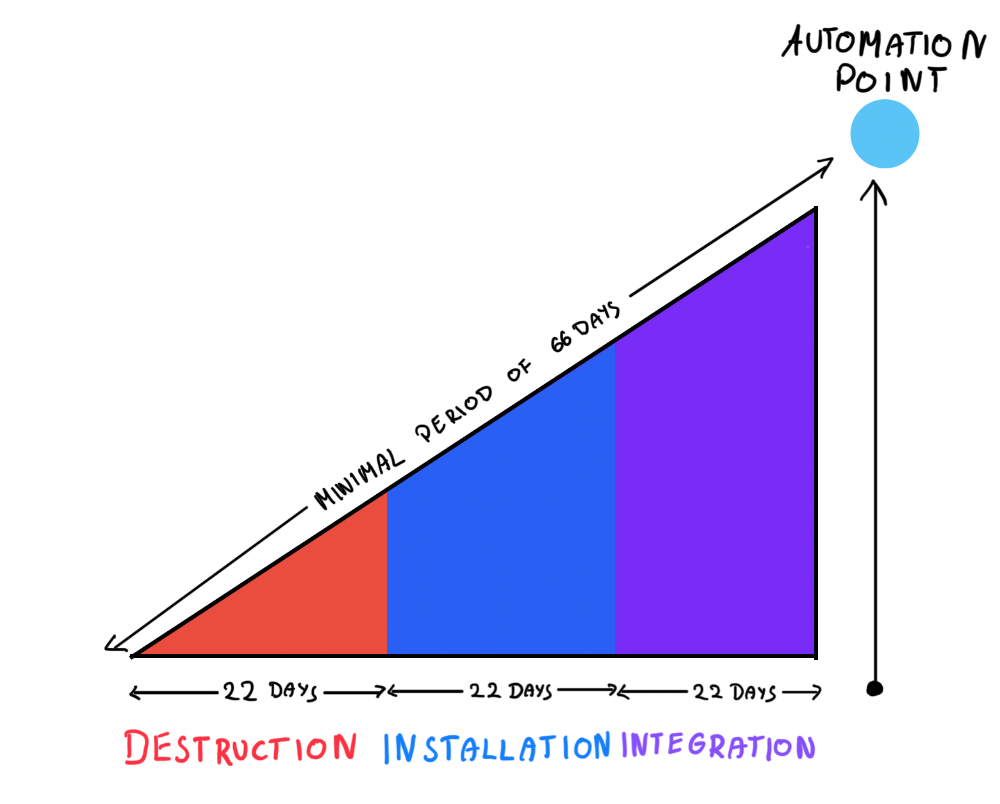

# The 5 AM Club
### by Robin Sharma

This book goes far beyond just advocating for early rising. It presents transformative concepts that can completely reshape your life.

Through the story of a struggling artist and entrepreneur who meet a mysterious mentor, Sharma demonstrates how waking up at 5 AM can transform your entire day and, ultimately, your life.

Whether you enjoy fiction or not, you'll likely find the story engaging since it effectively delivers its lessons through narrative.

The most important quote for me in that book was the following one:

> All changes are hard at first, messy in the middle and gorgeous at the end
>

The book has motivated me so deeply that I've been waking up early every day since I started writing this review three weeks ago.

I want to show you the most important concepts from the book and convince you it is worth reading.

## The Schema of Learning

In *The 5AM Club*, Robin Sharma introduces the **schema of learning**:

**Awareness → Decisions → Results**

Which is a simple yet profound framework for personal transformation. It highlights how deep, meaningful change begins with understanding, followed by deliberate choices, and ultimately leads to tangible outcomes.

## 20 / 20/ 20 formula

The cornerstone of the 5 AM Club is the 20/20/20 formula, dividing the first hour of the day into three 20-minute segments:

- **Move (20 minutes):** Engage in intense exercise to boost dopamine, reduce stress, and activate the brain’s learning centres. In my case, it is 15-minute workouts you can find on Youtube
- **Reflect (20 minutes):** Meditate, journal, or practice gratitude to centre your mind and plan the day. In my case, it is 5-minute meditation and planning of today’s TODOs
- **Grow (20 minutes):** Spend time learning—read, listen to podcasts, or study something that inspires intellectual growth. In my case - reading a book.

At the end of it I adjusted this formula with going on a walk with my dog at the end 😉

Scientific studies support these practices. For example, physical activity early in the morning improves cognitive function and emotional regulation, while reflection helps reduce anxiety and improves clarity.

### Habit installation

Sharma emphasizes the importance of making the 5AM routine a habit, following a 66-day framework to internalize new behaviors. This is based on research showing that habits form through three stages:

- **Destruction (Days 1-22):** It’s challenging as you break old patterns.
- **Installation (Days 23-44):** New routines replace the old, but resistance persists.
- **Integration (Days 45-66):** The habit feels natural and becomes automatic.This framework aligns with psychological studies on neuroplasticity, showing how the brain rewires itself through consistent repetition.

## **The Four Interior Empires**

True success, according to Sharma, requires cultivating these four domains:

- **Mindset:** Developing a positive, growth-oriented perspective.
- **Heartset:** Nurturing emotional intelligence and gratitude.
- **Healthset:** Prioritizing physical health and vitality.
- **Soulset:** Embracing spirituality and purpose to lead a fulfilling life.

### Why you should read it

The book stands out because it doesn’t just preach discipline—it explains the science behind it. Neurotransmitters like dopamine and serotonin, cortisol rhythms, and the circadian cycle all play a role in making the 5 AM routine effective. Additionally, Sharma’s storytelling keeps the reader engaged, making complex ideas easy to grasp.

# Summary

The book really changed my life, so I believe it can also change yours. If you are procrastinating often, you can wake up in the morning and feel like your life is a mess - go for it.
